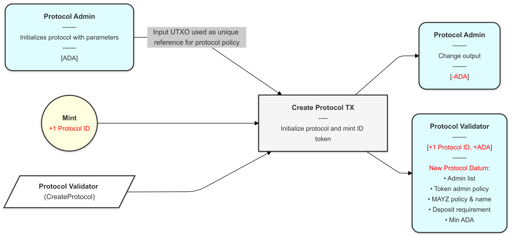
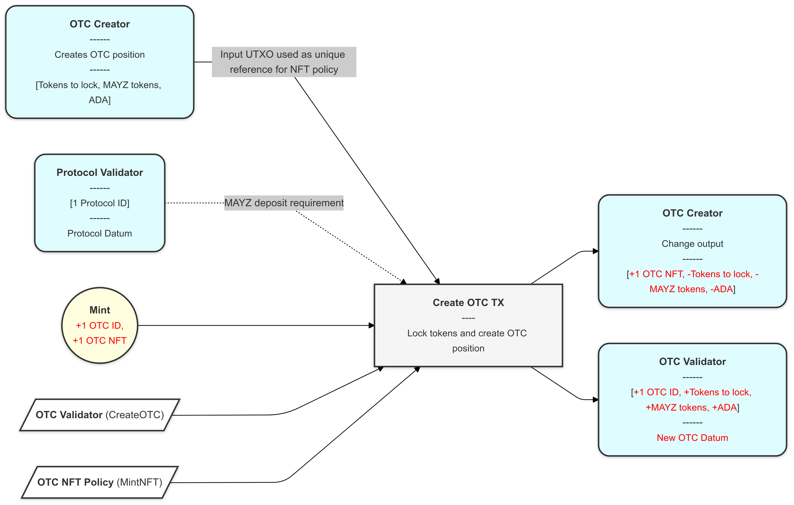
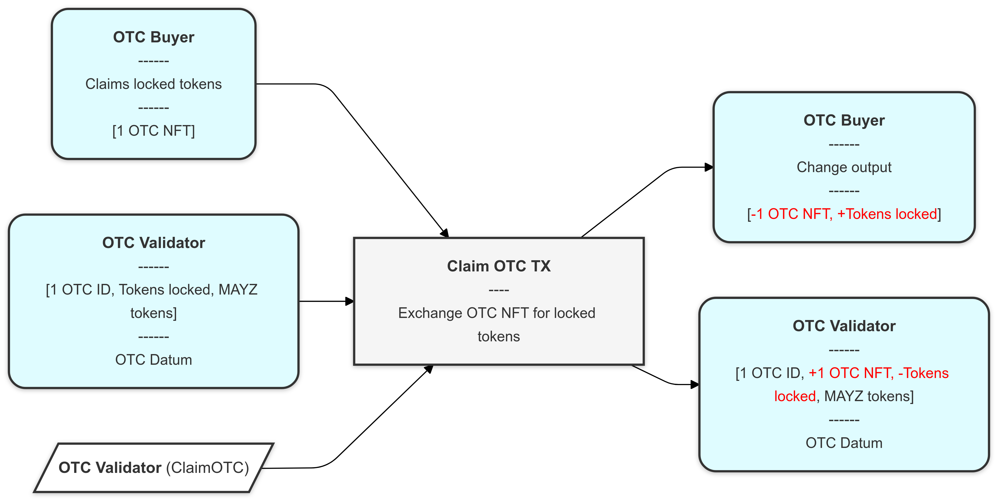
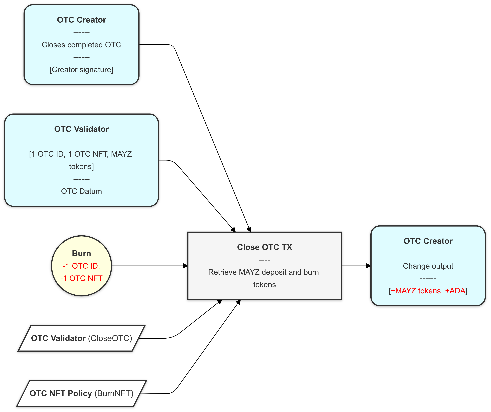
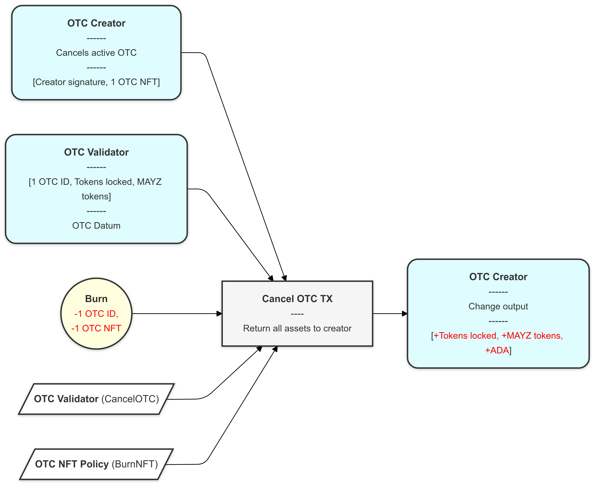

# Milestone 02 Report

## Overview

Milestone 02 focuses on the architecture and initial implementation of the MAYZ Trustless OTC Smart Contract. This milestone includes detailed architectural documentation, diagrams, and prototype components that will serve as a foundation for the full implementation in the subsequent milestones. The work in this milestone centers on defining and illustrating the components, interactions, and initial codebase structure of the OTC solution.

## Objectives

1. **Detailed Architecture Documentation**: Provide comprehensive documentation of the smart contract architecture, defining the roles and interactions of each component, including the Protocol Contract, OTC Contract, and OTC NFT Minting Policy.
2. **Diagram of Transaction**: Include visuals, such as transaction diagrams, to support the documentation and clarify the various operational use cases (e.g., Protocol Creation, OTC Creation, Claiming, Closing).
3. **Initial Codebase**: Establish the initial repository structure for smart contracts, written in Aiken, as a strategic decision to stay aligned with the latest developments in Cardano's Plutus V3 framework.

## Architectural Highlights

The architecture, detailed in the [README](./smart-contracts/README.md) in the `smart-contracts` folder, is comprised of three core smart contract components:

1. **Protocol Contract**: Manages protocol parameters and minting of Protocol ID tokens, leveraging Plutus V3 capabilities for enhanced efficiency.
2. **OTC Contract**: Manages the core OTC functionalities, including token locking, NFT issuance, and redemption.
3. **OTC NFT Minting Policy**: Defines a unique minting policy for each OTC position, ensuring that each OTC NFT is one-of-a-kind and linked to specific locked tokens.

Each of these contracts operates under a set of defined parameters, redeemers, and datum structures that ensure consistent behavior and meet protocol requirements.

## Transaction Diagrams

The following transaction diagrams provide a visual breakdown of key operations in the OTC smart contract system:

1. **Protocol Creation**: Establishes protocol governance parameters and mints the Protocol ID token.



2. **OTC Creation**: Enables users to lock tokens and receive an OTC NFT, representing ownership of the underlying assets.



3. **OTC Claiming**: Allows an OTC NFT holder to redeem the underlying tokens.



4. **OTC Closing and Cancellation**: Handles the burning of OTC tokens, ensuring that any deposits are returned to the creator or locked assets are retrieved in case of cancellation.





## Explanation of the Transition to Aiken

Initially, Milestone 03 was intended to deliver the smart contracts in Haskell; however, we opted to shift to **Aiken** for the following reasons:

1. **Adaptation with Cardano's Evolution**: Aiken is designed to work with the advancements in Cardano and Plutus V3, providing a more efficient and developer-friendly tool for smart contract development.
2. **Learning Opportunity**: Moving to Aiken allows us to gain experience with the latest Cardano tools, helping us deepen our understanding of Plutus V3 and build skills that will be valuable in future projects.
3. **Community Contribution**: As early adopters of Aiken, we can also provide feedback that may help improve the ecosystem, which benefits other developers working on Cardano.

> Note: This transition, while causing a slight delay, gives us a chance to work with newer Cardano technology. Using Aiken aligns our project with current developments in the Cardano ecosystem and supports our learning goals.

## Repository Structure
The codebase is organized as follows:

```
├── LICENSE
├── README.md
├── catalyst-reports
└── smart-contracts
    ├── LICENSE
    ├── README.md
    ├── aiken.lock
    ├── aiken.toml
    ├── build
    ├── charts
    │   ├── *.png (Diagrams)
    ├── docs
    ├── lib
    │   ├── types.ak
    │   └── utils.ak
    └── validators
        ├── protocol.ak
        ├── otc_validator.ak
        └── nft_validator.ak
```

Each file under the `validators` directory contains key logic for different contract roles in the architecture, while the `charts` directory includes transaction diagrams that visually represent the smart contract interactions.

## Links and Documentation

- **GitHub Repository**: [Repository](https://github.com/MAYZGitHub/mayz-otc)
- **Architecture and Documentation**: See the [README.md](../smart-contracts/README.md) file within the `smart-contracts` directory for a detailed breakdown of each component and its role within the architecture.
- **Transaction Diagrams**: The charts directory in the repository contains diagrams to support the documentation and clarify processes for both developers and reviewers.

## Notes for Reviewers

This report aims to fulfill the requirements for Milestone 02 by providing a clear, public, and technically detailed overview of the architecture and initial implementations. We look forward to your feedback and appreciate the support in helping us advance toward a fully functional, trustless OTC solution on Cardano.

For any questions or clarifications, please refer to our main [README](../README.md) or contact our team through the provided channels.

## Next Steps

1. **Milestone 03**: Focus on completing and testing the smart contracts, initially written in Aiken, ensuring full functionality according to the established architecture.
2. **Feedback Integration**: Incorporate any comments or suggestions from Catalyst reviewers to improve the documentation and implementation strategy.

By leveraging Aiken and Plutus V3, MAYZ Protocol demonstrates its commitment to innovation and staying at the forefront of blockchain technology within the Cardano ecosystem.

Thank you for reviewing this milestone.