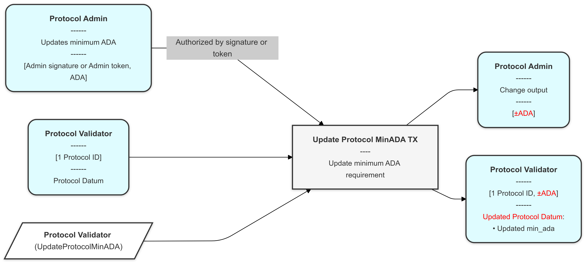
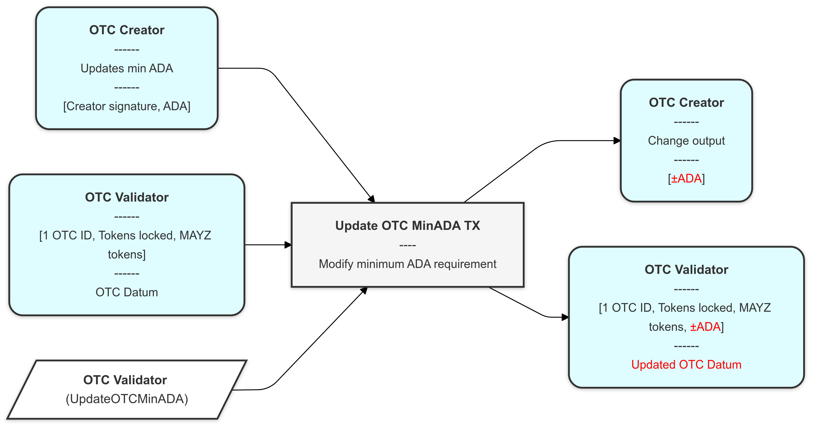

# MAYZ Trustless OTC Smart Contract - Architecture

## Table of Contents
- [MAYZ Trustless OTC Smart Contract - Architecture](#mayz-trustless-otc-smart-contract---architecture)
  - [Table of Contents](#table-of-contents)
  - [Overview](#overview)
    - [Dependencies](#dependencies)
  - [Install](#install)
  - [Smart Contract Components](#smart-contract-components)
    - [Protocol Contract](#protocol-contract)
      - [Parameters](#parameters)
      - [Protocol Datum Structure](#protocol-datum-structure)
        - [Field Descriptions](#field-descriptions)
      - [Authorization Logic](#authorization-logic)
      - [Protocol Redeemers](#protocol-redeemers)
        - [1. CreateProtocol](#1-createprotocol)
        - [2. UpdateProtocolParams](#2-updateprotocolparams)
        - [3. UpdateProtocolMinADA](#3-updateprotocolminada)
    - [OTC NFT Minting Policy](#otc-nft-minting-policy)
      - [Parameters](#parameters-1)
      - [Minting Policy Logic](#minting-policy-logic)
      - [Minting Policy Redeemers](#minting-policy-redeemers)
        - [1. MintNFT](#1-mintnft)
        - [2. BurnNFT](#2-burnnft)
    - [OTC Contract](#otc-contract)
      - [Parameters](#parameters-2)
      - [OTC Datum Structure](#otc-datum-structure)
        - [Field Descriptions](#field-descriptions-1)
      - [OTC Redeemers](#otc-redeemers)
        - [1. CreateOTC](#1-createotc)
        - [2. ClaimOTC](#2-claimotc)
        - [3. CloseOTC](#3-closeotc)
        - [4. CancelOTC](#4-cancelotc)
        - [5. UpdateOTCMinADA](#5-updateotcminada)
  - [Token Flow and Interactions](#token-flow-and-interactions)
    - [Token Standards](#token-standards)
    - [Creation Flow](#creation-flow)
    - [Redemption Flow](#redemption-flow)
    - [Closing Flow](#closing-flow)
    - [Cancellation Flow](#cancellation-flow)
  - [Transaction Diagrams](#transaction-diagrams)
    - [References](#references)
      - [Node Types](#node-types)
      - [Connections](#connections)
    - [Diagrams](#diagrams)
  - [Security Considerations](#security-considerations)
  - [Metadata Handling](#metadata-handling)

## Overview

The MAYZ Trustless OTC Smart Contract architecture consists of three main components written in Aiken v1.1.5:

1. Protocol Contract: Manages protocol parameters and mints Protocol ID tokens using Plutus V3 capabilities.
2. OTC Contract: Handles token locking, redemption processes, and minting/burning of OTC ID tokens using Plutus V3 capabilities.
3. OTC NFT Minting Policy: Dedicated policy for minting unique OTC NFT tokens per position.

### Dependencies
- Aiken v1.1.5
- aiken-lang/stdlib v2.1.0

## Install
```
# Install aikup
npm install -g @aiken-lang/aikup

# Run aikup
aikup

# Add Aiken to your PATH
export PATH="/home/manuelpadilla/.aiken/bin:$PATH"

# Build the project
aiken build

# Run tests (when you have them)
aiken check

# Format
aiken fmt

# Generate documentation
aiken docs

# Check Aiken version
aiken --version
```

## Smart Contract Components

### Protocol Contract

#### Parameters
Parameters for the Protocol Contract and its Policy ID minting:

```
type ProtocolParams {
  /// OutputReference that must be consumed when minting the Protocol ID token
  pp_protocol_policy_id_tx_out_ref: OutputReference,
  /// Protocol ID token name that will be minted
  pp_protocol_id_tn: ByteArray,
}
```

#### Protocol Datum Structure
Protocol Datum storing governance and configuration parameters:

```
type ProtocolDatum {
  /// List of payment verification key hashes that can perform administrative actions
  pd_admins: List<VerificationKeyHash>,
  /// Policy ID of the admin token that can also authorize administrative actions
  pd_token_admin_policy_id: PolicyId,
  /// MAYZ token policy ID
  pd_mayz_policy_id: PolicyId,
  /// MAYZ token name
  pd_mayz_tn: ByteArray,
  /// Required amount of $MAYZ tokens to be locked when creating an OTC position
  pd_mayz_deposit_requirement: Int,
  /// Minimum ADA required to be present in protocol UTXOs
  pd_min_ada: Int
}
```

##### Field Descriptions

1. **pd_admins** (List<VerificationKeyHash>)
   - Purpose: Stores the list of authorized administrator public key hashes
   - Usage: Controls who can perform protocol administration tasks
   - Validation: Used to verify administrative transactions
   - Type: List of Cardano verification key hashes
   - Note: Administrators can update protocol parameters and minimum ADA requirements

2. **pd_token_admin_policy_id** (PolicyId)
   - Purpose: Identifies the policy of tokens that grant administrative privileges
   - Usage: Allows token-based authorization for administrative actions
   - Validation: Any transaction containing this admin token can perform admin actions
   - Type: Cardano PolicyId (hash of the minting policy)
   - Note: Provides an alternative to direct wallet-based admin authorization
  
3. **pd_mayz_policy_id** (PolicyId)
   - Purpose: Stores the MAYZ token policy ID
   - Type: Cardano PolicyId

4. **pd_mayz_tn** (ByteArray)
   - Purpose: Stores the MAYZ token name
   - Type: ByteArray representing token name

5. **pd_mayz_deposit_requirement** (Int)
   - Purpose: Specifies the required amount of $MAYZ tokens for OTC creation
   - Usage: Users must lock this amount when creating an OTC position
   - Validation: Checked during OTC creation transactions
   - Type: Integer representing token quantity
   - Note: $MAYZ tokens are returned to creator after successful OTC completion

6. **pd_min_ada** (Int)
   - Purpose: Defines minimum ADA required in protocol UTXOs
   - Usage: Ensures sufficient ADA for transaction fees and UTXO minimum requirements
   - Type: Integer representing lovelace amount
   - Note: Can be updated by administrators based on network conditions

#### Authorization Logic
Administrative actions can be performed in two ways:
1. Direct wallet authorization: Transaction signed by a wallet whose payment verification key hash is in pd_admins
2. Token-based authorization: Transaction includes a token from pd_token_admin_policy_id

#### Protocol Redeemers
Redeemers for the Protocol Contract:

```
pub type ProtocolRedeemer {
  /// Initialize protocol by minting Protocol ID token
  CreateProtocol
  /// Update protocol parameters while maintaining Protocol ID token
  UpdateProtocolParams
  /// Update minimum ADA requirement for protocol UTXOs
  UpdateProtocolMinADA {
    /// New minimum ADA value
    new_min_ada: Int,
  }
}
``` 

##### 1. CreateProtocol
- Purpose: Initialize protocol by minting Protocol ID token and creating protocol UTXO
- Transaction Structure:
  * Input: Referenced UTXO from protocol parameters
  * Mint: Protocol ID token (amount: 1)
  * Output: Protocol UTXO with Protocol ID token and Protocol Datum
- Validations:
  * Protocol ID token mint amount must be exactly 1
  * Referenced UTXO must be consumed in the transaction
  * Output must contain valid Protocol Datum with initial parameters
  * Output must contain the Protocol ID token
  * Output must contain minimum ADA specified in Protocol Datum

##### 2. UpdateProtocolParams
- Purpose: Update protocol parameters while maintaining Protocol ID token
- Transaction Structure:
  * Input: Protocol UTXO (identified by Protocol ID token)
  * Output: Updated Protocol UTXO with Protocol ID token
- Validations:
  * Authorization: Must be signed by admin wallet OR include admin token
  * Single valid Protocol UTXO input (containing Protocol ID token)
  * Single valid Protocol UTXO output (containing Protocol ID token)
  * Only allowed parameter updates: pd_admins, pd_token_admin_policy_id and pd_mayz_deposit_requirement fields
  * Must maintain same value (Protocol ID token + ADA) between input/output

##### 3. UpdateProtocolMinADA
- Purpose: Update minimum ADA in protocol UTXO
- Transaction Structure:
  * Input: Protocol UTXO (identified by Protocol ID token)
  * Output: Updated Protocol UTXO with Protocol ID token
- Validations:
  * Authorization: Must be signed by admin wallet OR include admin token
  * Single valid Protocol UTXO input (containing Protocol ID token)
  * Single valid Protocol UTXO output (containing Protocol ID token)
  * Only allowed update: minimum ADA field
  * Output must contain updated minimum ADA amount

### OTC NFT Minting Policy

#### Parameters
Parameters for the OTC NFT Minting Policy:

```
type OTCNFTParams {
  /// OutputReference to be consumed
  pp_otc_nft_policy_id_tx_out_ref: OutputReference,
  /// Reference to OTC validator for validation. It's also the OTC ID PolicyID
  pp_otc_validator_hash: ValidatorHash,  
  /// Protocol ID policy ID
  pp_protocol_policy_id: PolicyId,
  /// Protocol ID token name
  pp_protocol_id_tn: ByteArray,
  /// OTC ID token name
  pp_otc_id_tn: ByteArray,
}
```

> Note: Each instance of the minting policy is unique due to its required OutputReference parameter.

#### Minting Policy Logic
The minting policy validates that:
- The OTC validator script is involved in the transaction
- The policy's unique OutputReference is consumed during minting
- Protocol parameters are validated via reference input during minting
- OTC NFT token follows required format
- Token minting/burning operations match OTC contract operations

Token Name Format:
```
"OTC-[TOKEN]-[AMOUNT]"
Example: "OTC-LEND-1.50M"
```

#### Minting Policy Redeemers
Redeemers for the OTC NFT Minting Policy:

```
pub type NFTRedeemer {
  /// Mint new OTC NFT token during position creation
  Mint
  /// Burn OTC NFT token during Close/Cancel
  Burn
}
```

##### 1. MintNFT 
- Purpose: Initialize OTC position by minting NFT ID token
- Transaction Structure: Same as [1. CreateOTC](#1-createotc)
- Validations:
  * OutputReference is consumed (ensures policy uniqueness)
  * Exactly one OTC NFT and one OTC ID token minted
  * Must occur in same transaction as OTC Contract CreateOTC
  * Token names follow correct format
  * OTC NFT token details match OTC datum

##### 2. BurnNFT
- Purpose: Burn OTC NFT token during CloseOTC or CancelOTC operations
- Transaction Structure: Same as [3. CloseOTC](#3-closeotc) or [4. CancelOTC](#4-cancelotc)
- Validations:
  * Exactly one OTC NFT and one OTC ID token burned
  * Must occur in same transaction as OTC Contract CloseOTC or CancelOTC
  * Proper OTC validator involvement

### OTC Contract

#### Parameters
Parameters for the OTC Validator and NFT ID Policy:

```
type OTCParams {
  /// Protocol ID policy ID
  pp_protocol_policy_id: PolicyId,
  /// Protocol ID token name
  pp_protocol_id_tn: ByteArray,
  /// OTC ID token name
  pp_otc_id_tn: ByteArray,
}
```

#### OTC Datum Structure
Datum for OTC positions storing state and configuration:

```
type OTCDatum {
  /// Payment verification key hash of the OTC position creator
  od_creator: VerificationKeyHash,
  /// Policy ID of the underlying tokens to be locked
  od_token_policy_id: PolicyId,
  /// Token name of the underlying tokens to be locked
  od_token_tn: ByteArray,
  /// Amount of underlying tokens locked in the OTC position
  od_token_amount: Int,
  /// Policy ID of the OTC NFT token minted for this position
  od_otc_nft_policy_id: PolicyId,
  /// Name of the OTC NFT token following naming convention
  od_otc_nft_tn: ByteArray,
  /// MAYZ token policy ID
  od_mayz_policy_id: PolicyId,
  /// MAYZ token name
  od_mayz_tn: ByteArray,
  /// Amount of $MAYZ Token locked as deposit for this OTC position
  od_mayz_locked: Int,
  /// Minimum ADA required to be present in the OTC UTXO
  od_min_ada: Int,
}
```

> Note: MAYZ token fields are stored in datum to maintain version consistency throughout the lifetime of the OTC position, even if protocol updates these values later.

##### Field Descriptions

1. **od_creator** (VerificationKeyHash)
   - Purpose: Identifies the creator of the OTC position
   - Usage: Used to verify authorization for Close and Cancel operations
   - Validation: Must match transaction signer for administrative actions
   - Type: Cardano verification key hash
   - Note: Only this address can retrieve $MAYZ Token deposit or cancel position

2. **od_token_policy_id** (PolicyId)
   - Purpose: Identifies the policy of the underlying tokens being locked
   - Usage: Used to verify correct tokens during Create and Claim operations
   - Validation: Must match the tokens being locked in Create operation
   - Type: Cardano PolicyId (hash of the minting policy)

3. **od_token_tn** (ByteArray)
   - Purpose: Specifies the name of the underlying tokens being locked
   - Usage: Combined with policy ID to uniquely identify locked tokens
   - Validation: Must match the token name of locked assets
   - Type: ByteArray representing token name

4. **od_token_amount** (Int)
   - Purpose: Specifies the quantity of underlying tokens locked
   - Usage: Ensures correct amount during Create and Claim operations
   - Validation: Must match actual locked token amount
   - Type: Integer representing token quantity

5. **od_otc_nft_policy_id** (PolicyId)
   - Purpose: Identifies the policy ID of the OTC NFT token
   - Usage: Used to verify the correct OTC NFT token during operations
   - Validation: Must match the policy ID of minted OTC NFT token
   - Type: Cardano PolicyId

6. **od_otc_nft_tn** (ByteArray)
   - Purpose: Stores the name of the OTC NFT token
   - Usage: Used to identify and validate the specific OTC NFT token
   - Validation: Must follow naming convention "OTC-[TOKEN]-[AMOUNT]"
   - Type: ByteArray representing token name
   - Example: "OTC-LEND-1.50M"
  
7. **od_mayz_policy_id**: PolicyId,
  - Purpose: Stores the MAYZ token policy ID
  - Type: Cardano PolicyId
  
8. **od_mayz_tn**: ByteArray,
  - Purpose: Stores the MAYZ token name
  - Type: ByteArray representing token name
  
9. **od_mayz_locked** (Int)
   - Purpose: Records amount of $MAYZ Token locked as deposit
   - Usage: Ensures correct deposit amount is maintained
   - Validation: Must match protocol's required deposit amount
   - Type: Integer representing $MAYZ Token quantity
   - Note: Retrieved by creator after successful completion or cancellation

10. **od_min_ada** (Int)
   - Purpose: Defines minimum ADA required in OTC UTXO
   - Usage: Ensures sufficient ADA for transaction fees and UTXO requirements
   - Type: Integer representing lovelace amount
   - Note: Returned to creator along with other assets

#### OTC Redeemers
Redeemers for the OTC Contract:

```
pub type OTCRedeemer {
  /// Create new OTC position and mint OTC ID token
  CreateOTC
  /// Claim underlying tokens using OTC NFT
  ClaimOTC
  /// Close completed position and retrieve MAYZ deposit
  CloseOTC
  /// Cancel active position and retrieve all assets
  CancelOTC
  /// Update minimum ADA requirement for OTC UTXO
  UpdateOTCMinADA {
    /// New minimum ADA value 
    new_min_ada: Int,
  }
}
```

##### 1. CreateOTC
- Purpose: Initialize OTC position by minting OTC ID token and locking assets
- Transaction Structure:
  * Reference Input: Protocol UTXO (for parameter validation)
  * Mint: OTC ID token (amount: 1) and OTC NFT token (amount: 1) 
  * Output 1: OTC UTXO containing:
    - OTC ID token
    - Underlying tokens
    - $MAYZ Token deposit
    - Minimum ADA
    - Proper OTC datum with minted token details
  * Output 2: OTC NFT token to creator address
- Validations:
  * Exactly one OTC NFT and one OTC ID token minted
  * Single valid OTC UTXO output with required assets
  * Required $MAYZ Token deposit matches Protocol Datum
  * Output datum contains correct OTC datum
  * OTC NFT token sent to creator

##### 2. ClaimOTC
- Purpose: Redeem underlying tokens using OTC NFT token
- Transaction Structure:
  * Input 1: User UTXO with OTC NFT token
  * Input 2: OTC UTXO (identified by OTC ID token)
  * Output 1: Updated OTC UTXO retaining $MAYZ Token deposit
  * Output 2: Underlying tokens to claimer
- Validations:
  * Single valid OTC input (containing OTC ID token)
  * Single valid OTC output (containing OTC ID token)
  * OTC NFT token present in transaction input
  * Output maintains $MAYZ Token deposit, minimum ADA, and OTC ID token and add the OTC NFT token 
  * Underlying tokens transferred to transaction signer

##### 3. CloseOTC
- Purpose: Close completed OTC position and retrieve $MAYZ Token deposit
- Transaction Structure:
  * Input: OTC UTXO (identified by OTC ID token) with OTC NFT token
  * Burn: OTC ID token and OTC NFT token
  * Output: $MAYZ Token and ADA to creator
- Validations:
  * Single valid OTC input (containing OTC ID token)
  * No OTC ID token in outputs
  * OTC NFT token present in input OTC UTXO
  * OTC ID token and OTC NFT token are burned
  * Transaction signed by original creator
  * $MAYZ Token deposit and minimum ADA returned to creator

##### 4. CancelOTC
- Purpose: Cancel active OTC position and retrieve all assets
- Transaction Structure:
  * Input 1: User UTXO with OTC NFT token
  * Input 2: OTC UTXO (identified by OTC ID token)
  * Burn: OTC ID token and OTC NFT token
  * Output: All assets to creator
- Validations:
  * Single valid OTC input (containing OTC ID token)
  * No OTC ID token in outputs
  * OTC NFT token present in transaction input
  * OTC ID token and OTC NFT token are burned
  * Transaction signed by original creator
  * All assets ($MAYZ Token, underlying tokens, minimum ADA) returned to creator

##### 5. UpdateOTCMinADA
- Purpose: Update minimum ADA in OTC UTXO
- Transaction Structure:
  * Input: OTC UTXO (identified by OTC ID token)
  * Output: Updated OTC UTXO with OTC ID token
- Validations:
  * Authorization: Must be signed by creator wallet
  * Single valid OTC UTXO input (containing OTC ID token)
  * Single valid OTC UTXO output (containing OTC ID token)
  * Only allowed update: minimum ADA field
  * Output must contain updated minimum ADA amount

## Token Flow and Interactions

### Token Standards
- OTC NFT Naming Convention: "OTC-[TOKEN]-[AMOUNT]"
  Example: "OTC-LEND-1.50M" for 1,500,000 LEND tokens
- Each OTC position has two associated tokens:
  1. OTC ID token: Always stays at validator script, identifies position
  2. OTC NFT token: Tradeable token representing position rights
- Both tokens are always minted and burned together
- Policy uniqueness ensured by OutputReference parameter
- Each new OTC position requires a new minting policy instance

### Creation Flow
1. User deposits underlying tokens + MAYZ tokens
2. New OTC NFT minting policy instance is created (unique per position)
3. OTC Contract mints OTC ID token
4. MAYZ token details from protocol are stored in position datum
5. OTC NFT token sent to creator
6. Underlying tokens locked in contract

### Redemption Flow
1. OTC NFT holder initiates claim
2. Contract verifies OTC NFT
3. Underlying tokens released to claimer
4. MAYZ deposit, OTC ID token and OTC NFT token remain locked

### Closing Flow
1. Creator initiates close after successful claim
2. OTC Contract burns OTC ID token
3. OTC NFT policy burns NFT token
4. MAYZ deposit returned to creator

### Cancellation Flow
1. Creator initiates cancellation
2. OTC Contract burns OTC ID token
3. OTC NFT policy burns NFT token
4. All locked assets returned to creator

## Transaction Diagrams

The following transaction diagrams provide a visual breakdown of key operations in the OTC smart contract system.

### References

#### Node Types

| Shape | Description | Visual |
|-------|-------------|--------|
| Rounded Rectangle | UTXO/Address box - Represents inputs and outputs | `fill:#dffcff,stroke:#333,stroke-width:2px,rx:15,ry:15` |
| Rectangle | Transaction box - Represents the transaction being executed | `fill:#f5f5f5,stroke:#333,stroke-width:2px` |
| Right-leaning Parallelogram | Script validator - Represents validator scripts involved with the Redeemer required | `fill:white,stroke:#333,stroke-width:2px,shape:lean-r` |
| Circle | Token minting/burning - Shows token operations | `fill:#ffffdf,stroke:#333,stroke-width:2px,rx:50` |

#### Connections

| Arrow Type | Meaning |
|------------|---------|
| Solid Arrow | Input flow / Dependencies |
| Input → Transaction | Shows which UTXOs are consumed |
| Transaction → Output | Shows which UTXOs are created |
| Script → Transaction | Shows which validators are involved |
| Token Op → Transaction | Shows minting/burning operations |

### Diagrams

1. **[Protocol Creation](../smart-contracts/charts/Protocol-Create-Tx.png)**: Establishes protocol governance parameters and mints the Protocol ID token.


2. **[Protocol Update Min ADA](../smart-contracts/charts/Protocol-Update-MinADA-Tx.png)**: Updates the minimum ADA requirement for protocol UTXOs.



3. **[Protocol Update Parameters](../smart-contracts/charts/Protocol-Update-Params-Tx.png)**: Modifies the protocol's administrative parameters such as admin lists or deposit requirements.


4. **[OTC Creation](../smart-contracts/charts/OTC-Create-Tx.png)**: Enables users to lock tokens and receive an OTC NFT, representing ownership of the underlying assets.


5. **[OTC Update Min ADA](../smart-contracts/charts/OTC-Update-MinADA-Tx.png)**: Updates the minimum ADA requirement specifically for OTC UTXOs.



6. **[OTC Claiming](../smart-contracts/charts/OTC-Claim-Tx.png)**: Allows an OTC NFT holder to redeem the underlying tokens.


7. **[OTC Closing](../smart-contracts/charts/OTC-Close-Tx.png)**: Closes an OTC position and returns the deposited ADA or MAYZ tokens to the creator after a successful claim.


8. **[OTC Cancellation](../smart-contracts/charts/OTC-Cancel-Tx.png)**: Cancels an active OTC position, retrieving all locked assets back to the creator.


## Security Considerations

1. Token Validation
   - Strict verification of token policies
   - Amount validation for all token operations
   - Proper burning verification

2. Authorization
   - Creator-only operations for close/cancel
   - Admin-only protocol updates
   - Token-based authorization checks

3. Value Preservation
   - Input/output value matching
   - Minimum ADA requirements
   - Proper token allocation

4. Policy Uniqueness
   - Each OTC NFT minting policy instance is unique due to OutputReference parameter
   - OutputReference must be consumed during minting
   - This prevents token name collisions across different OTC positions
   - Even if two positions have identical token amounts, they'll have different policy IDs

5. Version Control
   - MAYZ token details stored in OTC datum
   - Protects positions from unexpected protocol updates
   - Ensures consistent token validation throughout position lifecycle

## Metadata Handling

Additional token metadata is included during minting transactions:
- Underlying token details
- Amount representations
- Creator information
- Timestamp data